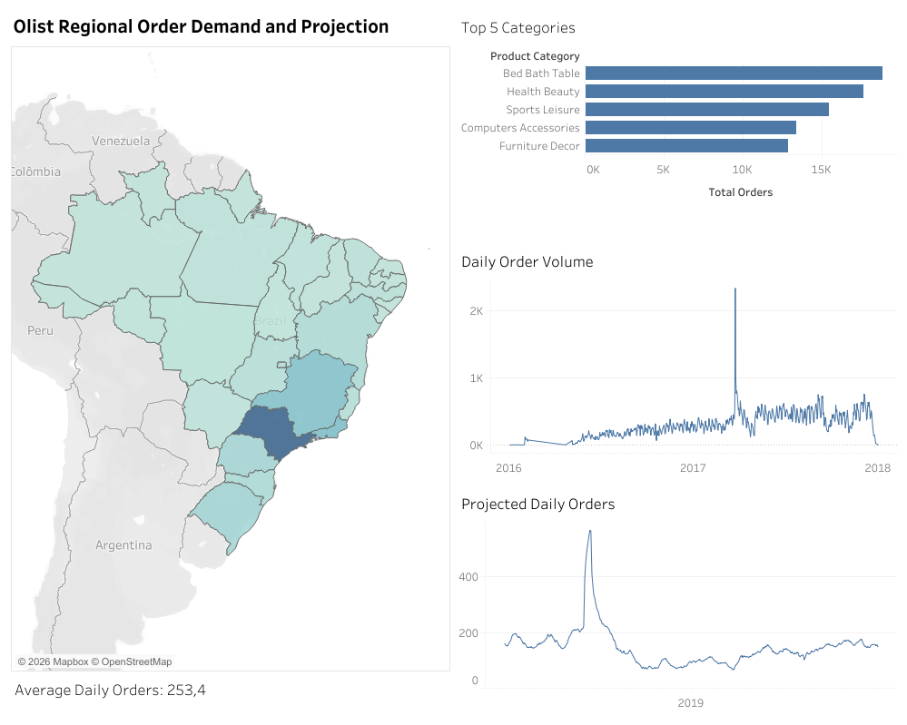

# Retail Demand Signals and Projections – Olist

## Overview
This project analyzes retail demand patterns using historical data from Olist, a Brazilian e-commerce intermediary that connects sellers to major online marketplaces. The objective is to identify demand signals and project future demand behavior, supporting planning and decision making through data driven insights.

## Business Problem
Olist operates as an intermediary between sellers and large online marketplaces, aggregating order and demand information across multiple regions. Understanding demand signals within this context is essential for anticipating demand fluctuations, identifying regional patterns, and supporting planning activities. This analysis focuses on extracting demand patterns and producing demand projections based on historical order behavior from the Olist platform.

## Dataset
Public e-commerce dataset containing historical order information from Olist, including customer location, order timestamps, and transactional details across multiple Brazilian regions.

**Datasource:**  
[Brazilian E-Commerce Public Dataset by Olist (Kaggle)](https://www.kaggle.com/datasets/olistbr/brazilian-ecommerce)

## Analytical Workflow
- Loaded and validated historical demand data from the Olist dataset using Python
- Explored demand patterns, trends, and seasonality over time
- Analyzed demand signals across different time periods and regions
- Produced demand projections based on historical order behavior
- Interpreted results with a focus on retail demand monitoring and planning

## Dashboard

The dashboard explores demand behavior and projections across Brazilian regions served by Olist. It highlights regional differences in demand patterns, seasonal effects, and projected demand trends, complementing the analytical findings with a geographic perspective.

## Key Insights
- Demand patterns vary significantly across Brazilian regions
- Clear seasonal and trend components are observable in historical Olist demand data
- Regional demand signals provide valuable context for short term demand projections

## Tools and Technologies
- **Python** (Pandas, NumPy, Matplotlib, Seaborn)
- **Data Visualization:** Tableau
